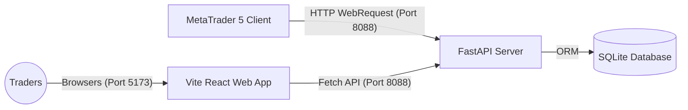

# คู่มือการใช้งานระบบ THANKHUN Trade Jornal อย่างละเอียด (User & Setup Guide)

คู่มือฉบับนี้อธิบายถึงขั้นตอนการเปิดใช้งานระบบ, การตั้งค่าความเชื่อมโยงระหว่าง MetaTrader 5 (MT5) และเว็บแอปพลิเคชันผ่านโปรแกรมสำเร็จรูป **JornaltradePublisherEA** ไปจนถึงการใช้งานฟีเจอร์วิเคราะห์พอร์ตโฟลิโอและการแชร์พอร์ตต่อสาธารณะ

---

## 📌 สารบัญ (Table of Contents)
1. [สถาปัตยกรรมระบบโดยสังเขป (System Architecture)](#1-สถาปัตยกรรมระบบโดยสังเขป-system-architecture)
2. [ขั้นตอนที่ 1: การรันเซิร์ฟเวอร์ระบบ (Starting the Servers)](#ขั้นตอนที่-1-การรันเซิร์ฟเวอร์ระบบ-starting-the-servers)
3. [ขั้นตอนที่ 2: การตั้งค่าพอร์ตผ่านหน้าเว็บ (Web Application Onboarding)](#ขั้นตอนที่-2-การตั้งค่าพอร์ตผ่านหน้าเว็บ-web-application-onboarding)
4. [ขั้นตอนที่ 3: การติดตั้งและตั้งค่าฝั่ง MetaTrader 5 (Publisher EA)](#ขั้นตอนที่-3-การติดตั้งและตั้งค่าฝั่ง-metatrader-5-publisher-ea)
5. [ขั้นตอนที่ 4: การวิเคราะห์ข้อมูลพอร์ตและ AI Analytics](#ขั้นตอนที่-4-การวิเคราะห์ข้อมูลพอร์ตและ-ai-analytics)
6. [ขั้นตอนที่ 5: การสร้างลิงก์แชร์พอร์ตสาธารณะ (Public Sharing)](#ขั้นตอนที่-5-การสร้างลิงก์แชร์พอร์ตสาธารณะ-public-sharing)
7. [การแก้ไขปัญหาเบื้องต้น (Troubleshooting)](#การแก้ไขปัญหาเบื้องต้น-troubleshooting)

---

## 1. สถาปัตยกรรมระบบโดยสังเขป (System Architecture)

ระบบประกอบด้วย 3 ส่วนหลักที่สื่อสารกันแบบ Real-Time:


1.  **Frontend Web App (React + Vite)**: ทำงานบนพอร์ต `5173` ทำหน้าที่เป็นแดชบอร์ดหลักของผู้ใช้งาน
2.  **Backend API (FastAPI)**: ทำงานบนพอร์ต `8088` ทำหน้าที่จัดการสิทธิ์ผู้ใช้, จัดเก็บข้อมูลพอร์ตการเทรด และจัดทำรายงานข้อมูลต่างๆ
3.  **MT5 Publisher EA**: รันบน MT5 ทำหน้าที่ส่งข้อมูล Deals และ Positions ปัจจุบันแบบ incremental มายัง Backend

---

## ขั้นตอนที่ 1: การรันเซิร์ฟเวอร์ระบบ (Starting the Servers)

หากปิดคอมพิวเตอร์ หรือเครื่องเกิดการรีสตาร์ท คุณสามารถเปิดระบบทั้ง Backend และ Frontend ได้ง่ายๆ ผ่านไฟล์คีย์ลัด [run_all.bat](file:///d:/EA/Thankhun_Tradejornal/run_all.bat) ที่อยู่ในโฟลเดอร์หลักเพียงดับเบิ้ลคลิกเดียว หรือเลือกทำตามขั้นตอนรันมือด้านล่างนี้:

### 1.1 การเปิดใช้งานฝั่ง Backend (FastAPI)
1.  เปิดโปรแกรม Terminal หรือ PowerShell
2.  ย้ายโฟลเดอร์ไปยังโฟลเดอร์โครงการ: `cd d:\EA\Thankhun_Tradejornal\backend`
3.  รันเซิร์ฟเวอร์โดยเรียกผ่าน Virtual Environment `.venv` ด้วยคำสั่ง:
    ```powershell
    .\.venv\Scripts\python -m uvicorn app.main:app --reload --host 127.0.0.1 --port 8088
    ```
4.  หน้าจอจะแสดงสถานะ `Application startup complete.` และพร้อมให้บริการที่ [http://127.0.0.1:8088](http://127.0.0.1:8088)

### 1.2 การเปิดใช้งานฝั่ง Frontend (Vite + React)
1.  เปิด Terminal หน้าต่างใหม่
2.  ย้ายโฟลเดอร์ไปยังฝั่งเว็บ: `cd d:\EA\Thankhun_Tradejornal\frontend`
3.  รันคำสั่งสำหรับเปิดบริการนักพัฒนา (Development Server):
    ```powershell
    npm run dev
    ```
4.  เปิดเบราว์เซอร์ไปที่ [http://localhost:5173](http://localhost:5173) เพื่อใช้งานหน้าเว็บ

---

## ขั้นตอนที่ 2: การตั้งค่าพอร์ตผ่านหน้าเว็บ (Web Application Onboarding)

เมื่อเข้าสู่ระบบทางเบราว์เซอร์แล้ว ให้ดำเนินการดังนี้:

### 2.1 การลงทะเบียนและเข้าสู่ระบบ
1.  เมื่อเปิดหน้าเว็บครั้งแรก จะอยู่ที่หน้า **Login** หากยังไม่มีบัญชี ให้กรอกข้อมูลในหน้า **Register**
2.  กรอกรายละเอียด อีเมล, รหัสผ่าน (ขั้นต่ำ 6 อักขระ) และ ชื่อผู้ใช้งาน
3.  หลังจากกดลงทะเบียน ให้เข้าสู่ระบบด้วยบัญชีที่สร้างขึ้น

### 2.2 การเพิ่มข้อมูลบัญชีเทรด MT5 (Add Account)
1.  เมื่อเข้าสู่ระบบแล้ว ให้กดปุ่ม **"Add Account"** (เครื่องหมายบวกสีส้ม/เขียว)
2.  กรอกรายละเอียดข้อมูลพอร์ตเทรด:
    *   **Account Number (Login)**: หมายเลขบัญชี MT5 ของคุณ
    *   **Broker Name**: ชื่อโบรกเกอร์ (เช่น *Exness Technologies Ltd*)
    *   **Server Name**: ชื่อเซิร์ฟเวอร์ในการเทรด (เช่น *Exness-MT5-Real10*)
    *   **Account Name**: ชื่อเรียกตั้งพอร์ต (เพื่อความเข้าใจส่วนตัว)
    *   **Currency**: สกุลเงินหลักของพอร์ต (เริ่มต้น: *USD*)
    *   **Leverage**: เลเวอเรจพอร์ต (เช่น *100* หรือ *2000*)
    *   **Connection Type**: ให้เลือกเป็น **Publisher EA**
3.  กดปุ่ม **"Save Account"**
4.  ระบบจะขึ้นป๊อปอัพแสดงคู่มือแนะนำพร้อมกับ **Publisher Token** (ตัวอย่าง: `JT-D3E4F5A2...`)
5.  **ให้ทำการคัดลอก (Copy) รหัส Token นี้เก็บไว้** เพื่อใช้กรอกในตัวโปรแกรม EA ฝั่ง MT5

---

## ขั้นตอนที่ 3: การติดตั้งและตั้งค่าฝั่ง MetaTrader 5 (Publisher EA)

ฝั่ง MT5 มีหน้าที่ดึงประวัติธุรกรรมเพื่ออัปโหลดขึ้นเซิร์ฟเวอร์อัตโนมัติ:

### 3.1 การเปิดใช้งาน WebRequest ใน MT5 (สำคัญมาก)
โดยปกติ MT5 จะบล็อกการทำ HTTP Request ของทุก EA เพื่อความปลอดภัย เราต้องเปิดสิทธิ์อนุญาตก่อน:
1.  เปิดโปรแกรม **MetaTrader 5**
2.  ไปที่เมนูหลักด้านบน **Tools** &rarr; **Options** (หรือคีย์ลัด `Ctrl + O`)
3.  เลือกแท็บ **Expert Advisors**
4.  ติ๊กเลือกช่อง **"Allow WebRequest for listed URL:"**
5.  ดับเบิ้ลคลิกที่ช่องสีขาวด้านล่างสุด แล้วกรอกค่า URL ดังนี้:
    ```
    http://127.0.0.1:8088
    ```
6.  กด **OK** เพื่อบันทึกการตั้งค่า

### 3.2 ติดตั้งไฟล์ EA ลงในโฟลเดอร์ของ MT5
1.  คัดลอกไฟล์สคริปต์ [JornaltradePublisherEA.mq5](file:///d:/EA/Thankhun_Tradejornal/mql5/JornaltradePublisherEA.mq5)
2.  ในโปรแกรม MT5 ไปที่เมนู **File** &rarr; **Open Data Folder**
3.  เปิดเข้าไปยังโฟลเดอร์ย่อย: `MQL5` &rarr; `Experts`
4.  วางไฟล์ `JornaltradePublisherEA.mq5` ลงในโฟลเดอร์นี้
5.  กลับมาที่หน้าต่าง **Navigator** ด้านซ้ายของโปรแกรม MT5 คลิกขวาที่หัวข้อ **Experts** แล้วกด **Refresh** จะเห็นรายชื่อ `JornaltradePublisherEA` ขึ้นมา

### 3.3 การเปิดทำงาน EA บัญชีเทรด
1.  **สำคัญมาก:** เปิดกราฟเปล่าคู่เงินใดก็ได้อย่างน้อย 1 กราฟขึ้นมา (เช่น กราฟ EURUSD กราฟเปล่า)
    *   *ห้ามนำ EA นี้ลากไปทับกราฟเดียวกันกับ EA ตัวเทรดหลักที่กำลังรันอยู่ เนื่องจาก MT5 จำกัดให้หนึ่งกราฟรันได้แค่ 1 EA*
2.  ลากตัว `JornaltradePublisherEA` จากแถบ Navigator มาวางลงบนกราฟเปล่านั้น
3.  ที่หน้าต่างตั้งค่าการทำงาน ให้เลือกแท็บ **Inputs** และกำหนดค่าพารามิเตอร์ดังนี้:
    *   `InpServerUrl`: ปล่อยเป็นค่าเริ่มต้น `http://127.0.0.1:8088` (หรือระบุ IP/Domain กรณีติดตั้งบน Cloud)
    *   `InpPublisherToken`: วางรหัส **Publisher Token** ที่คัดลอกมาจากขั้นตอนการเพิ่มบัญชีทางหน้าเว็บ
    *   `InpSyncInterval`: รอบวินาทีในการส่งข้อมูล Snapshot สถานะพอร์ตปัจจุบัน (ค่าตั้งต้น: `60` วินาที)
    *   `InpHeartbeatInterval`: รอบวินาทีที่ส่งสัญญาณแจ้งว่า EA ออนไลน์ (ค่าตั้งต้น: `120` วินาที)
4.  กดปุ่ม **OK**
5.  ตรวจเช็กให้มั่นใจว่าปุ่ม **Algo Trading** บนแถบเครื่องมือหลักของโปรแกรม MT5 มีไอคอนเป็น **สีเขียว** (เปิดใช้งาน)
6.  หากรันสำเร็จ ครั้งแรก EA จะแสดง Log ในแท็บ *Experts* ด้านล่างว่า `Jornaltrade: History bootstrapped on initialization.` และเริ่มซิงค์ประวัติการเทรดอดีตทั้งหมดเข้าสู่ระบบทันที

---

## 4. การวิเคราะห์ข้อมูลพอร์ตและ AI Analytics

เมื่อซิงค์ข้อมูลพอร์ตและดีลเข้าสู่ระบบแล้ว แดชบอร์ดจะประมวลผลข้อมูลให้อัตโนมัติ:

1.  **แดชบอร์ดสรุปสถิติ (Overview Dashboard)**:
    *   **Balance / Equity**: ยอดเงินทุนคงเหลือปัจจุบัน และมูลค่ารวมพอร์ตล่าสุด
    *   **Profit / Max Drawdown**: กำไรสะสมสุทธิ และเปอร์เซ็นต์จุดขาดทุนสูงสุดที่พอร์ตเคยเผชิญ (Max Drawdown)
        *   *สูตรคำนวณปรับปรุงล่าสุด:* ระบบจะทำการคำนวณแบบ Peak-to-Trough แบบเรียลไทม์จากเส้นกราฟ Equity Curve โดยทำการ **หักลบ/ชดเชยมูลค่าการฝากเงินหรือถอนเงินออกจากการคำนวณอัตโนมัติ** เพื่อไม่ให้การทำธุรกรรมฝากถอนเงินไปส่งผลให้เปอร์เซ็นต์ Drawdown สูงขึ้นผิดปกติ
    *   **Win Rate / Profit Factor**: เปอร์เซ็นต์ชนะของออเดอร์ทั้งหมด (คิดจากดีลที่ปิดแบบกำไรสุทธิเป็นบวก Net Profit >= 0 ตามมาตรฐานสากล เช่น Myfxbook) และสัดส่วนกำไรต่ออัตราการขาดทุน
2.  **เส้นกราฟการเติบโต (Equity & Growth Curve)**:
    *   แสดงแนวโน้มยอดเงิน Balance และ Equity ย้อนหลังรายวัน
    *   **สัญลักษณ์ธุรกรรมการเงิน (Transaction Indicators):** หากวันใดมีการทำธุรกรรมฝากหรือถอนเงิน ระบบจะแสดงจุดสัญลักษณ์บนเส้น Balance (📥 สีเขียวสำหรับการฝากเงิน / 📤 สีแดงสำหรับการถอนเงิน) พร้อมระบุรายละเอียดจำนวนเงินชดเชยเมื่อเอาเมาส์ไปชี้ (Tooltip)
3.  **ปฏิทินกำไรรายวัน (Calendar PnL)**:
    *   แสดงปฏิทินที่ระบุจำนวนเงินบวกหรือลบในแต่ละวัน ทำให้วิเคราะห์ได้ง่ายว่าวันใดสร้างผลกำไรสูงสุดหรือขาดทุนเท่าใด
4.  **ตารางสรุปประวัติล่าสุด (Recent Closed Deals)**:
    *   แสดงข้อมูลออเดอร์ที่ปิดเสร็จสิ้นแล้วอย่างละเอียด
    *   **การแสดงผลสีตัวเลขกำไรขาดทุน (Net Profit Coloring):** ตัวเลขในคอลัมน์ Net Profit จะใช้การไฮไลต์สีตามผลลัพธ์ (ตัวเลขบวก/กำไรจะเป็น **สีเขียว** และตัวเลขลบ/ขาดทุนจะเป็น **สีแดง**) เพื่อให้อ่านประวัติได้ง่ายขึ้น
5.  **ระบบวิเคราะห์พฤติกรรมเทรดด้วย AI (AI Summary)**:
    *   **การตั้งค่า API Key และโมเดล:** สามารถกดปุ่ม **"ตั้งค่าระบบ AI"** บนเมนูด้านบนเพื่อใส่คีย์ เลือกค่าย AI (Gemini, Openrouter, Nvidia, OpenAI) และกำหนดชื่อรุ่นโมเดลที่ต้องการได้เองจากหน้าเว็บ
        *   *ข้อแนะนำสำหรับคีย์ Google Gemini:* แนะนำให้ใช้รุ่นโมเดล **`gemini-2.5-flash`** หรือ **`gemini-2.0-flash`** เพื่อความรวดเร็วและหลีกเลี่ยงปัญหาเรื่องอัตราการจำกัดโควตา (Rate Limit / Timeout)
    *   AI จะนำประวัติการเทรดจริง เช่น อัตราการแพ้ชนะ, ระยะเวลาเฉลี่ยที่ถือออเดอร์, ผลกำไรรวม, ค่า Drawdown และประวัติดีลล่าสุด ส่งไปเขียนบทวิเคราะห์พฤติกรรมทางจิตวิทยาในการเทรด, จุดอ่อนที่กำลังเจอ และแนวทางปรับปรุงระบบเทรดเป็นภาษาไทยอย่างเป็นระบบ

---

## 5. การสร้างลิงก์แชร์พอร์ตสาธารณะ (Public Sharing)

คุณสามารถสร้างหน้าแสดงผลสถิติพอร์ตเพื่อส่งให้ผู้อื่นเข้าชมผลการเทรดได้โดยไม่ต้องล็อกอิน:

1.  ที่หน้าแดชบอร์ดหลัก ให้เลือกพอร์ตที่ต้องการแชร์ แล้วคลิกไอคอนแชร์ หรือเลือกเมนู **"Share Link"**
2.  กำหนดคุณสมบัติการเปิดเผยข้อมูลความเป็นส่วนตัว (Privacy Settings):
    *   **Show Balance**: เปิด/ปิดการแสดงผลยอดเงินทุนและปริมาณ Lot
    *   **Show Magic Number**: เปิด/ปิดการแสดงผลตัวเลขระบบ EA ที่ใช้เทรด
    *   **Show Comment**: เปิด/ปิดการแสดงผลคอมเมนต์ออเดอร์
3.  ระบุชื่อเส้นทาง URL (Slug) ที่ต้องการ (หากปล่อยว่าง ระบบจะทำการสุ่ม Slug ปลอดภัยให้คุณ)
4.  กด **"Create Link"** ระบบจะสร้างลิงก์เฉพาะให้ เช่น `http://localhost:5173/p/your-slug`
5.  กด **"Copy Link"** และแชร์ให้บุคคลอื่นได้ทันที
6.  *วิธีปิดการแชร์*: หากต้องการหยุดแชร์พอร์ต ให้คลิกเลือกตั้งค่าแชร์เดิมแล้วกดปุ่ม **"Revoke Share Link"** หรือลบลิงก์แชร์ หน้านั้นจะปิดการทำงานทันที

---

## การแก้ไขปัญหาเบื้องต้น (Troubleshooting)

### 🔴 EA แจ้ง Error `WebRequest failed. Error code: 4014`
*   **สาเหตุ**: โปรแกรม MT5 ยังไม่ได้รับการเพิ่มอนุญาต URL ปลายทางในรายการ WebRequest
*   **วิธีแก้ไข**: ไปที่ `Tools -> Options -> Expert Advisors` ติ๊กอนุญาต WebRequest และเพิ่ม `http://127.0.0.1:8088` ลงไปอย่างถูกต้อง (ห้ามพิมพ์ตัวอักษรผิดหรือมีเว้นวรรค)

### 🔴 หน้าเว็บขึ้นสถานะพอร์ตเป็น `pending_verify` ตลอดเวลา
*   **สาเหตุ**: ตัว EA ไม่ทำงาน หรือไม่สามารถส่งสัญญาณ Heartbeat ข้อมูลมาหา Backend ได้
*   **วิธีแก้ไข**:
    1.  ตรวจสอบว่ากดปุ่มเปิดทำงาน **Algo Trading** (เป็นไอคอนสีเขียว) ด้านบนเมนูของ MT5 หรือยัง
    2.  ตรวจสอบแท็บ `Experts` และ `Journal` ของ MT5 ด้านล่าง ว่ามีข้อความแจ้งเตือนข้อผิดพลาดเกี่ยวกับการเชื่อมต่อหรือไม่
    3.  ตรวจสอบว่าคัดลอก **Publisher Token** ใน Input ของ EA ถูกต้องหรือไม่
    4.  เช็กว่ารันเซิร์ฟเวอร์ Backend สำเร็จหรือไม่โดยการเปิดลองเรียก [http://127.0.0.1:8088/](http://127.0.0.1:8088/) ผ่านบราว์เซอร์

### 🔴 กำไรบนปฏิทินรายวัน (Calendar PnL) หรือเส้นกราฟ Equity Curve ไม่แสดงข้อมูล
*   **สาเหตุ**: ข้อมูลดีลบนฐานข้อมูลยังไม่มีการประมวลผลดีลที่ปิดตัวลง (`entry_type = out`) หรือพอร์ตเทรดพึ่งมีการซิงค์เข้ามาวันแรก จึงยังไม่มีชุดประวัติภาพถ่ายข้อมูลรายวัน
*   **วิธีแก้ไข**: เมื่อรัน EA ทิ้งไว้ และมีการเปิด/ปิดออเดอร์ใหม่เพิ่มขึ้น หรือเมื่อวันเวลาเปลี่ยนผ่านไป 24 ชั่วโมง ระบบจัดเก็บ Daily Snapshot จะทำงานและแสดงกราฟ Equity และปฏิทินอย่างสมบูรณ์โดยอัตโนมัติ
